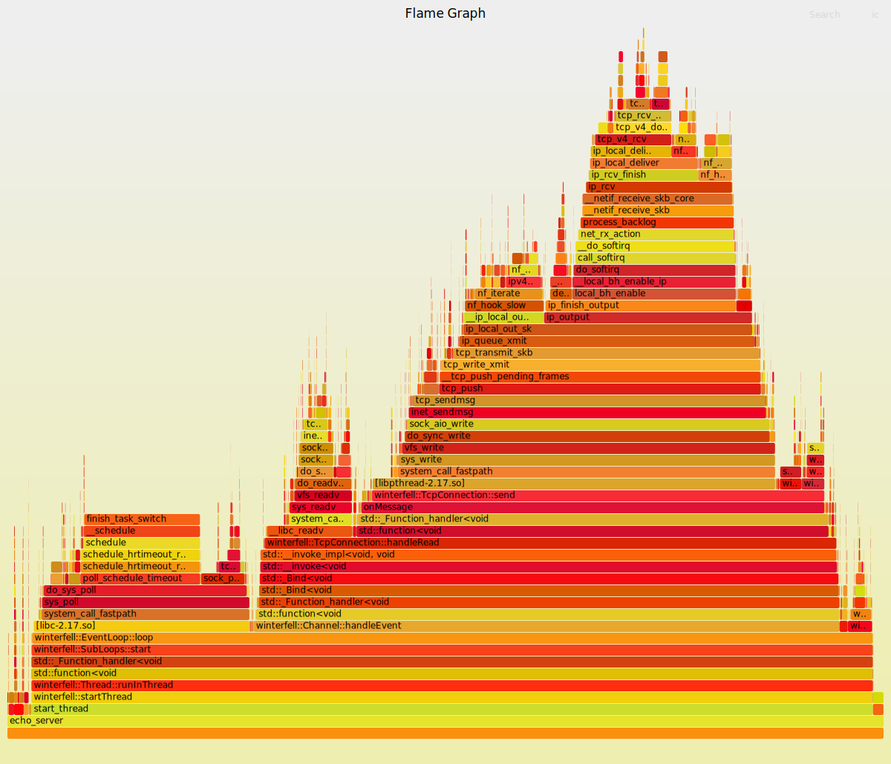
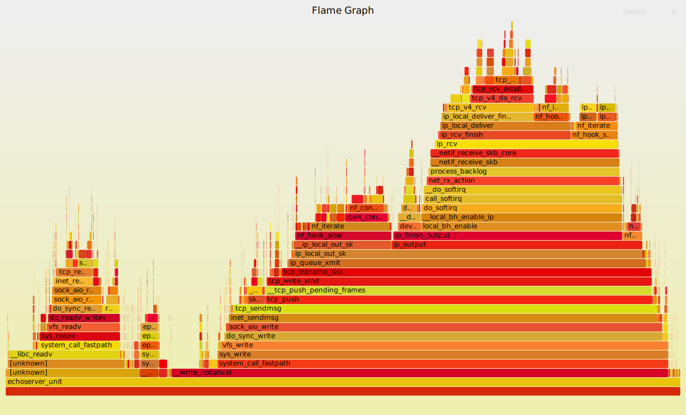

<!--
 * @Author: Maoxiang Sun
 * @Date: 2023-01-06 21:21:55
 * @Description: README
-->

# Winterfell

> Winter Is Coming.

## requirement

Cmake 3.6.0

gcc 4.8.5 (support std=c++11)

[GoogleTest](https://github.com/google/googletest)

libprotoc 2.5.0

## FlameGraph

火焰图以一个全局的视野来看待时间分布，它从底部往顶部，列出所有可能导致性能瓶颈的调用栈。

### winterfell 

### muduo

## 性能比较

使用EchoServer进行测试，测试命令 ab -n 1000000 -c 100 -k http://127.0.0.1:8888/ 

muduo:

**Time per request:       0.866 [ms] (mean)** 

**Time per request:       0.009 [ms] (mean, across all concurrent requests)**

**Transfer rate:          11953.37 [Kbytes/sec] received**

winterfell:

**Time per request:       1.058 [ms] (mean)**

**Time per request:       0.011 [ms] (mean, across all concurrent requests)**

**Transfer rate:          9781.69 [Kbytes/sec] received**