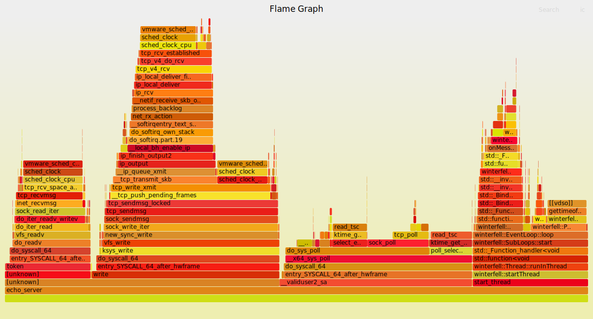
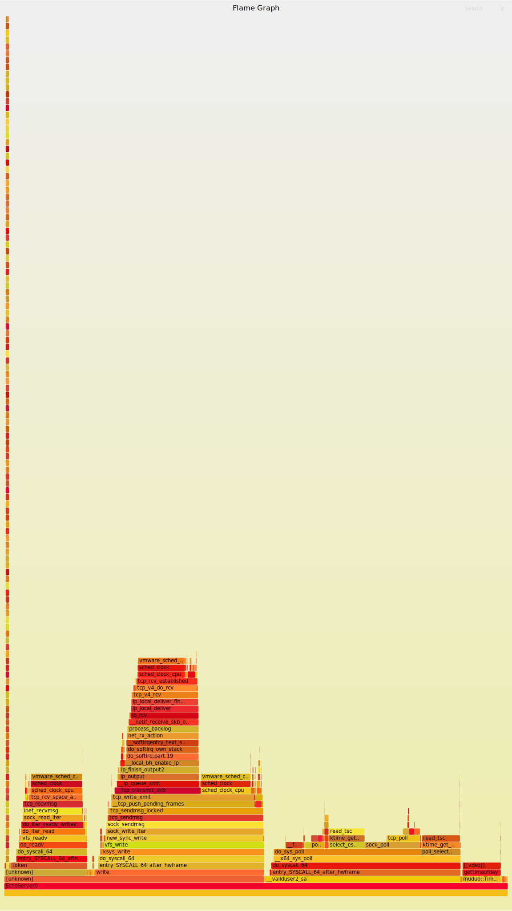

<!--
 * @Author: Maoxiang Sun
 * @Date: 2023-01-06 21:21:55
 * @Description: README
-->

# Winterfell

> Winter Is Coming.

## requirement

Cmake >= 3.6.0

gcc >= 4.8.5 (support std=c++11)

[GoogleTest](https://github.com/google/googletest)

libprotoc >= 3.0

## support feature

1. 实现非阻塞 + Reactor模型的高并发低延时的服务器框架。

2. 支持定时器，onConnection，onMessage、onWriteComplete回调，使用Buffer配合非阻塞IO。

3. 主从reactor，主reactor负责accept消息，建立TcpConnection，并使用Round-robin分配给子reactor。

4. 模仿[time/rate](https://github.com/golang/time/blob/master/rate/rate.go) 实现的令牌桶限流器，测试及用法见[example/echo_rate](/example/echo_rate/)。

5. 使用timing wheel踢掉空闲链接。(TODO)

6. http (TODO)

7. 整合Protobuf实现 RPC(TODO)

## FlameGraph

火焰图以一个全局的视野来看待时间分布，它从底部往顶部，列出所有可能导致性能瓶颈的调用栈。

### winterfell 

### muduo

## 性能比较

使用EchoServer进行测试，测试命令 ab -n 1000000 -c 100 -k http://127.0.0.1:8888/ 

muduo:

**Time per request:       0.866 [ms] (mean)** 

**Time per request:       0.009 [ms] (mean, across all concurrent requests)**

**Transfer rate:          11953.37 [Kbytes/sec] received**

winterfell:

**Time per request:       1.058 [ms] (mean)**

**Time per request:       0.011 [ms] (mean, across all concurrent requests)**

**Transfer rate:          9781.69 [Kbytes/sec] received**